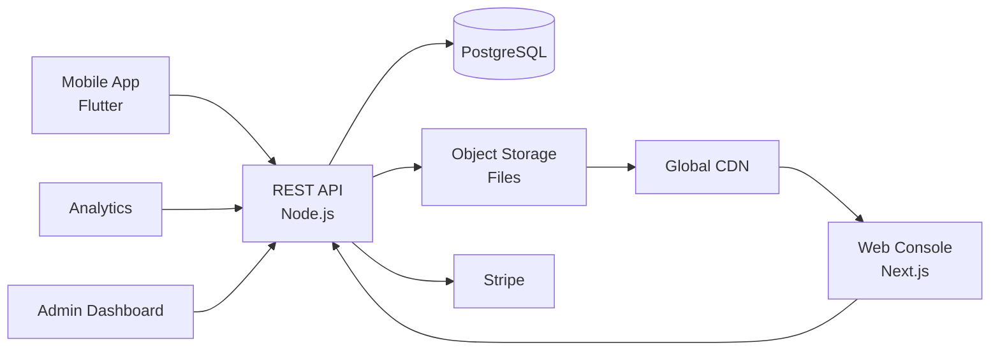

# Google Drive Clone — White-Label File Sharing & Cloud Storage Platform by Miracuves

**MXTransfer** is a production-ready, white-label Google Drive clone: a complete file-sharing & cloud-storage platform with upload, share, preview, and admin console — delivered with **100% source code ownership** in **6 working days**.

> 📦 **See it running before you talk to anyone.** Live upload app, web console, and admin dashboard — demo credentials are printed on the [solution page](https://miracuves.com/google-drive-clone#demo). No sales call required.

---

## 🚀 Live Demos

| Environment | URL | What you can test |
|---|---|---|
| 📱 Mobile App | [mas.mimeld.com](https://mas.mimeld.com) | Upload, share, preview, secure link |
| 🌐 Web Console | [mxtransfer.mimeld.com](https://mxtransfer.mimeld.com) | Full file management in browser |
| 📊 Analytics | [Solution page → Demo](https://miracuves.com/google-drive-clone#demo) | File views, geo, downloads |
| 🛠️ Admin Dashboard | [Solution page → Demo](https://miracuves.com/google-drive-clone#demo) | Users, plans, abuse, storage |

Demo credentials for all environments: **[miracuves.com/google-drive-clone → Demo section](https://miracuves.com/google-drive-clone/#demo)**

---

## ✨ What Makes This Google Drive Clone Different

Most file-sharing scripts stop at "upload + share link." This platform ships with the features that actually run a file-sharing *business*:

- **Up To 100GB Free Transfers** — large-file transfer with no signup needed — same conversion trick WeTransfer pioneered
- **Secure Links + Expiry** — 
- **Preview 200+ File Types** — every share link gets password, expiry, and watermark options — Dropbox Smart Workspace basics
- **E-Signature Built In** — custom domain, logo, colors on every share page — what agencies need for client work
- **White-Label Branding** — request signatures on PDFs, track signer progress, audit log — saves a SaaS subscription for clients

## 📦 Core Features

**User:** upload & preview · secure share links · expiry controls · password protection · folders · search · e-sign · mobile sync

**Account:** storage usage analytics · recipient analytics · custom branding on shared pages

**Admin:** user management · plans & quotas · storage quotas · abuse takedowns · analytics

## 🏗️ Architecture

**Stack:** React/Next.js for web · Flutter mobile · Node.js backend · S3-compatible object storage · Postgres for metadata · Redis for share-link cache · Stripe, regional gateways

## 📋 What’s Included

- ✅ Full source code — backend, web, mobile apps, panels (no encryption, no license locks)
- ✅ Deployment to your servers & app store submission assistance
- ✅ Your branding — white-label rename, logo, colors, domain
- ✅ 60 days post-launch support + 12 months of free updates
- ✅ Documentation & handover

**Pricing:** from **$2,799**, transparent on the [solution page](https://miracuves.com/google-drive-clone/#pricing) — no "contact us for quote" games.

## 🆚 Why Not Build From Scratch?

Custom file-sharing platforms run $60k–$250k and 4–8 months. A proven white-label base gets you to market in 6 working days for a fraction of that, with your budget preserved for storage margins and integration outreach.

## 📚 Resources

- 📖 [Google Drive Clone — Full Solution Page](https://miracuves.com/google-drive-clone) (features, pricing, demos, FAQ)
- 💰 [How Much Does a File Sharing App Cost in 2026?](https://miracuves.com/google-drive-clone#pricing) pricing breakdown & what's included
- 📝 [Best Google Drive Clone Script in 2026](https://miracuves.com/google-drive-clone/blog/) features, pricing & launch guide
- 🧠 [Large-File Transfers: Conversion to Paid Plans](https://miracuves.com/google-drive-clone/blog/) freemium math, WeTransfer play
- ✅ [Miracuves Facts & Claims Ledger](https://miracuves.com/google-drive-clone/facts/) every claim we make, verified

## 🏢 About Miracuves

[Miracuves Solutions](https://miracuves.com) builds white-label clone apps and custom software from Mumbai, India — 90+ ready-made solutions, live demos for every product, transparent pricing, and delivery in 6 working days. Operating since 2010.

**Talk to us:** [WhatsApp](https://wa.me/919830009649) · [Schedule a consultation](https://miracuves.com/schedule-consultation/) · [miracuves.com](https://miracuves.com)

---

### ⚠️ Note on This Repository

This repository is a product overview. The full source code is delivered to clients on purchase — see [what’s included](https://miracuves.com/google-drive-clone/#included). For a hands-on evaluation, use the live demos above; credentials are public on the solution page.

*Keywords: google drive clone, google drive clone script, file sharing, cloud storage, large file transfer, white label WeTransfer, e-signature, Flutter storage app, Node.js storage*

---

<!--
══════════════════════════════════════════════════
TEMPLATE VARIABLE KEY — auto-generated from Netflix-Clone pattern
══════════════════════════════════════════════════
{APP_NAME}        Google Drive Clone
{MX_NAME}         MXTransfer
{CATEGORY}        File Sharing & Cloud Storage Platform
{DEMO_WEB}        mxtransfer.mimeld.com
{PRICE}           $2,799
{SLUG}            google-drive-clone
{SOLUTION_URL}    https://miracuves.com/google-drive-clone/
{VERTICAL}        storage

See /tmp/verticals/storage.txt for the vertical config used to generate this README.
══════════════════════════════════════════════════
-->